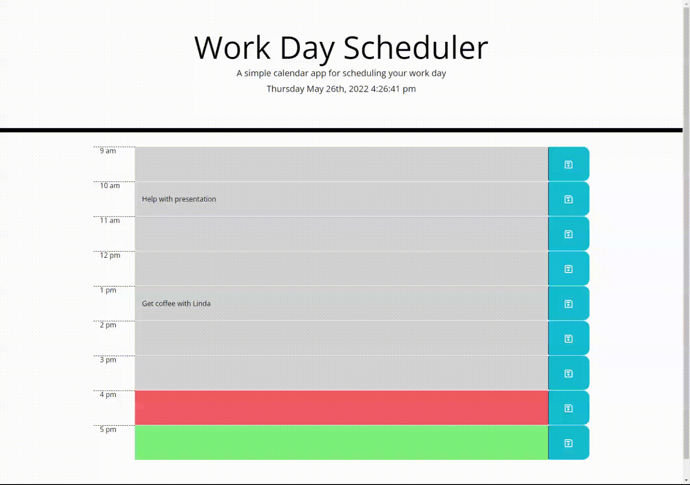

# Project Name - change to the name of your project
​
## Table of contents
​
- [Overview](#overview)
  - [The challenge](#the-challenge)
  - [User Story](#user-story)
  - [Acceptance Criteria](#acceptance-criteria)
  - [Screenshot](#screenshot)
  - [Links](#links)
- [My process](#my-process)
  - [Built with](#built-with)
  - [What I learned](#what-i-learned)
  - [Continued development](#continued-development)
  - [Useful resources](#useful-resources)
- [Author](#author)
- [Acknowledgments](#acknowledgments)
​
**Note: Delete this note and update the table of contents based on what sections you keep.**
​
## Overview
​
### The challenge
​
The "Work Day Scheduler App" is a basic workday scheduling application.  The project began with starter code and needing to be completed to allow for satisfactory functionality and seamless appearance.  The application runs in the browser and utlizes dynamically updated HTML and CSS using jQuery.

Much of the functionality relies on the effective use of Moment.js to update time tile colors and display the current date.
​
### User Story
​
```md
AS AN employee with a busy schedule
I WANT to add important events to a daily planner
SO THAT I can manage my time effectively
```
​
### Acceptance Criteria
​
```md
GIVEN I am using a daily planner to create a schedule
WHEN I open the planner
THEN the current day is displayed at the top of the calendar
WHEN I scroll down
THEN I am presented with timeblocks for standard business hours
WHEN I view the timeblocks for that day
THEN each timeblock is color coded to indicate whether it is in the past, present, or future
WHEN I click into a timeblock
THEN I can enter an event
WHEN I click the save button for that timeblock
THEN the text for that event is saved in local storage
WHEN I refresh the page
THEN the saved events persist
```
​
### Screenshot
​

​
### Links
​
- Solution URL: [https://github.com/Unicorn-Barf/Workday_Scheduling_App](https://github.com/Unicorn-Barf/Workday_Scheduling_App)
- Live Site URL: [https://unicorn-barf.github.io/Workday_Scheduling_App/](https://unicorn-barf.github.io/Workday_Scheduling_App/)
​
## My process
​
### Built with
​
- HTML5
- CSS
- jQuery
- Moment.js
- Bootstrap
​

​
### What I learned
​
While working on this project I learned a few new concepts.  First, I learned a new method to target HTML elements using jQuery, `closest()`.  Here is an example of how I employed this method:
```js
// get value from input trim leading/trailing whitespaces
let events = $('#events', $(this).closest("div.row")).val().trim();
// save parent id for object key name
let parentId = $(btnEl).closest("div.row").attr('id');
```
This was a valuable tool to learn because I had trouble with two user action cases on my event listener.  The user could possible click the `<button>` element or the `` element inside it.  Regardless of the case I needed to access the node of the closest `<div>` with the class of "row".  Using `closest()` gave me a way to directly access my desired element regardless of which element the user specifically clicked on.

Another interesting issue that arrose was types of data and how to compare them.  I needed to tell the code when to change the background colors of the tiles depending on the current time.  The code I utilized to get the Moment.js current hour data was giving me a string.  I could get the data attribute from the `<div>` parent element of my `<input>` element which returned a number.  In order to use conditional statements and effectively compared the values, I needed them both as a number.  Here was my solution using `parseInt()`:
```js
let currentHour = parseInt(moment().format('H'));
let hourId = $(tileArr[i]).parent().data('time');
```

The last concept I learned about was how to utilize Bootstrap classes to easily format my project.  Here is an example of using the "row" and "col" classes to quickly create dynamically capable sizing for a grid of schedule tiles:
```html
<!-- Schedule cards -->
<div class="row" id="9am">
    <div class="col-1 timeblock hour">9 am</div>
    <div class="col-10" data-when="past" data-time="9"><input type="textid="events"></div>
    <button type="button" id="saveBtn" class="btn col-1"></button>
</div>
```
This saved time over having to create and define flexbox properies on my own using css.
​
​

​
### Continued development
​
I have realized throughout this project there are many ways to code.  In particular, there are numberous methods for targeting elements efficiently and effectively.  I want to continue to learn and understand these so I can more fluently manipulate the elements and data that I need to target.

In addition, Boostrap is a new and fun tool for me.  I haven't yet fully realized its complete scope and power; I look forward to experimenting with all it has to offer.

Lastly, I plan on using Moment.js and similar APIs to work on using time not only for displaying but also as a tool to add better functionality and greater UX to my applications.
​
### Useful resources
​
- [Stackoverflow jQuery element id selector](https://stackoverflow.com/questions/902839/how-to-select-all-elements-with-a-particular-id-in-jquery) - This question on stackoverflow refreshed my memory on getting an element by id with jQuery.
- [css-tricks: data attributes](https://css-tricks.com/a-complete-guide-to-data-attributes/#styling) - A very cool guide to data attributes and how to utilize them in CSS.  This helped me dynamically style elements using data attributes.
- [Guide to Event Handling](https://eloquentjavascript.net/15_event.html) - This was a helpful reference for information and examples about event handlers.

​
## Author
​
- Website - [Nolan Spence](https://unicorn-barf.github.io/Portfolio_Website_HTML_CSS/)
- LinkedIn - [https://www.linkedin.com/in/aerospence/](https://www.linkedin.com/in/aerospence/)
​
​
## Acknowledgments
​
Thank you to my tutor, Jacob Nordan, for helping me through my codeblindness to fix my data types.